# HypnoSVG

Генератор гипнотических SVG-халтонов из изображений. Загрузи фото → настраивай фигуры, сетки, цвета и анимации → получи залипательную графику.

[](https://python.org)
[](LICENSE)

## Что это

Сайт-генератор: загружаешь любое изображение, выбираешь стиль (точки, кольца, линии, треугольники…), настраиваешь сетку и цвета — получаешь компактный SVG с CSS-анимацией мерцания.

## Сопутствующая документация

- [frontend-assembly/README.md](frontend-assembly/README.md) -- инструкция по сборке библиотек фронтенда (alppine.js, tailwindcss, htmx)

## Предыстория

Проект вырос из CLI-утилиты: [2026-image-hatftone-effect](https://git.cube2.ru/erjemin/2026-image-hatftone-effect)

```bash
# Старый CLI
poetry run python main.py img.jpg
# → imgj.svg
```

Теперь это будет (возможно и надеюсь) микросайт с интерактивным интерфейсом и кучей эффектов... Заодно тестирую Сберовский GigaChat.
Планы см.: [plan-draft.md](_blueprint/plan-draft.md)

## Демо


